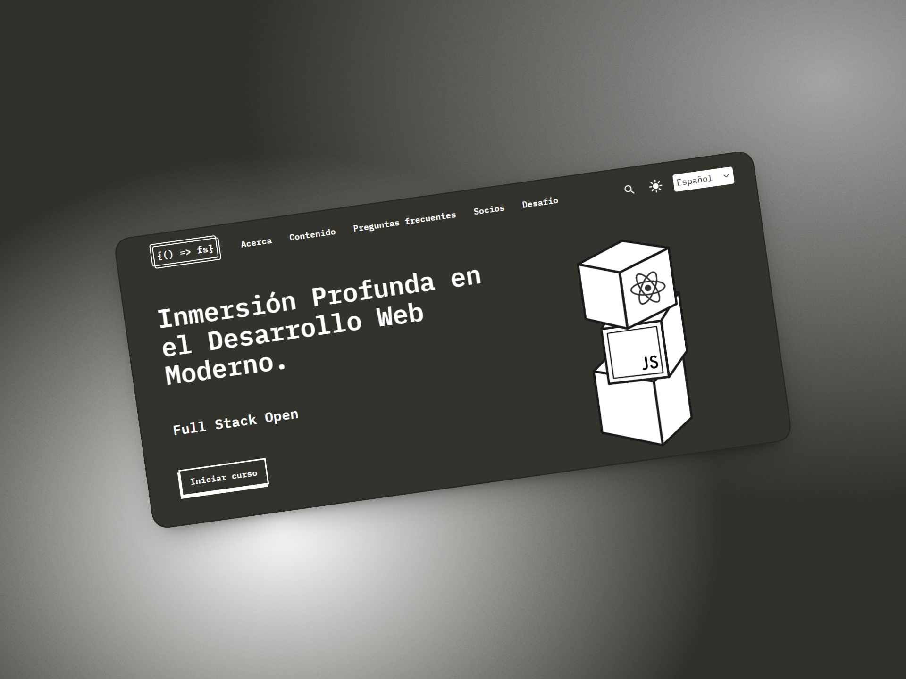

# 📚 Full Stack Open — Mis notas y ejercicios

> Repositorio de ejercicios del curso [Full Stack Open](https://fullstackopen.com/) de la Universidad de Helsinki.  
> Además de los ejercicios, este README funciona como mi **guía de referencia personal** para construir una aplicación web full stack desde cero.



---

> 📝 **Proyecto de referencia:** todos los ejemplos de esta guía pertenecen a una **app de notas** — una aplicación simple que permite crear, leer y eliminar notas.

---

## 🛠️ Stack utilizado


---

## 📕 Documentación oficial
- [Documentación de React](https://react.dev/)
- [Documentación de Node.js](https://nodejs.org/en/docs/)
- [Documentación de Express](https://expressjs.com/)

---

## 📋 Tabla de contenidos

1. [Estructura del proyecto](#1-estructura-del-proyecto)
2. [Frontend con React](#2-frontend-con-react)
3. [Simulando un backend con json-server](#3-simulando-un-backend-con-json-server)
4. [Backend con Node.js y Express](#4-backend-con-nodejs-y-express)
5. [Conectando frontend y backend](#5-conectando-frontend-y-backend)
6. [Subir la aplicación a internet](#6-subir-la-aplicación-a-internet)

---

## 1. 🗂️ Estructura del proyecto

La forma más ordenada de organizar una aplicación full stack es separar el frontend y el backend en carpetas independientes dentro del mismo repositorio.

```
notes-app/
├── frontend/
│   ├── public/
│   ├── src/
│   │   ├── components/        # Componentes reutilizables (Button, Note, Form...)
│   │   ├── pages/             # Vistas/páginas completas (Home, Login...)
│   │   ├── services/          # Lógica de comunicación con la API (axios)
│   │   ├── context/           # Contextos de React (AuthContext...)
│   │   ├── hooks/             # Custom hooks (useNotes, useFetch...)
│   │   ├── assets/            # Imágenes, íconos, fuentes
│   │   ├── App.jsx
│   │   └── main.jsx
│   ├── .env                   # VITE_API_URL=http://localhost:3001
│   ├── index.html
│   └── package.json
│
├── backend/
│   ├── prisma/
│   │   └── schema.prisma      # Modelos de la base de datos
│   ├── routes/                # Rutas por recurso (notes.js, users.js...)
│   ├── middleware/            # Middlewares propios (auth.js, errorHandler.js...)
│   ├── controllers/           # Lógica de cada ruta (opcional)
│   ├── index.js               # Punto de entrada del servidor
│   ├── .env                   # DATABASE_URL, JWT_SECRET, PORT
│   └── package.json
│
├── .gitignore
└── README.md
```

> **Nota:** tanto `frontend/.env` como `backend/.env` deben estar en el `.gitignore`. Nunca se commitean.

---

## 2. Frontend con React

El frontend es la parte de la aplicación que ve el usuario. Con React construimos interfaces a partir de **componentes**, que son funciones que devuelven JSX (HTML dentro de JavaScript).

### Crear el proyecto

```bash
npm create vite@latest frontend -- --template react
cd frontend
npm install
npm run dev
```

### Componentes

Un componente es una función que recibe `props` y devuelve JSX. La regla principal: si un dato puede cambiar y debe reflejarse en la pantalla, usá `useState`.

```jsx
// components/Note.jsx
const Note = ({ note, onDelete }) => {
  return (
    <li>
      {note.content}
      <button onClick={() => onDelete(note.id)}>Eliminar</button>
    </li>
  )
}

export default Note
```

### Hooks esenciales

Los hooks son funciones especiales de React que permiten usar estado y otras características dentro de componentes funcionales.

| Hook | Para qué sirve |
|---|---|
| `useState` | Estado local del componente |
| `useEffect` | Efectos secundarios (fetch, suscripciones) |
| `useContext` | Compartir estado global sin prop drilling |
| `useRef` | Referencia a un elemento del DOM |

**`useState`** — maneja un valor que puede cambiar. Cada vez que cambia, React vuelve a renderizar el componente.

```jsx
import { useState } from 'react'

const App = () => {
  const [notes, setNotes] = useState([])
  const [newNote, setNewNote] = useState('')

  const addNote = () => {
    setNotes(notes.concat({ id: Date.now(), content: newNote }))
    setNewNote('')
  }

  return (
    <div>
      <input value={newNote} onChange={e => setNewNote(e.target.value)} />
      <button onClick={addNote}>Agregar</button>
      <ul>
        {notes.map(note => <li key={note.id}>{note.content}</li>)}
      </ul>
    </div>
  )
}
```

**`useEffect`** — ejecuta código como consecuencia de algo: que el componente se monte, que una variable cambie, etc. Se usa mucho para traer datos del backend al cargar la página.

```jsx
import { useState, useEffect } from 'react'
import noteService from './services/noteService'

const App = () => {
  const [notes, setNotes] = useState([])

  useEffect(() => {
    // Esto se ejecuta una sola vez, cuando el componente aparece en pantalla
    noteService.getAll().then(data => setNotes(data))
  }, []) // El array vacío [] significa "solo al montar"

  // ...
}
```

> Si en vez de `[]` ponés una variable dentro del array, el efecto se vuelve a ejecutar cada vez que esa variable cambia: `[userId]`.

---

## 3. Simulando un backend con json-server

Durante el desarrollo del frontend, todavía no tenemos un backend propio. Para no bloquearnos, `json-server` genera una API REST completa a partir de un archivo JSON, sin escribir ningún código de servidor.

```bash
npm install -D json-server
```

Crear un archivo `db.json` en la raíz del proyecto:

```json
{
  "notes": [
    { "id": 1, "content": "HTML es fácil", "important": true },
    { "id": 2, "content": "El navegador solo puede ejecutar JavaScript", "important": false }
  ]
}
```

Agregar el script en `package.json`:

```json
"scripts": {
  "server": "json-server --watch db.json --port 3001"
}
```

```bash
npm run server
```

Con esto, `json-server` expone automáticamente los endpoints `GET`, `POST`, `PUT` y `DELETE` en `http://localhost:3001/notes`. Más adelante, cuando el backend real esté listo, simplemente se cambia la URL y el resto del código no cambia.

### Comunicación con el backend

En una aplicación full stack hay dos partes separadas: el **frontend** (React, corre en el navegador) y el **backend** (Node/Express, corre en un servidor). Para que se comuniquen, el frontend hace **peticiones HTTP** al backend usando `fetch` (nativo del navegador) o `axios` (una librería que simplifica la sintaxis y el manejo de errores).

El backend recibe esa petición, hace lo que tenga que hacer (consultar la base de datos, guardar algo, etc.) y le devuelve una respuesta en formato JSON que el frontend usa para actualizar la pantalla.

```bash
npm install axios
```

Para mantener el código ordenado, las llamadas al backend no van directamente dentro de los componentes, sino en archivos separados dentro de `services/`. Cada archivo agrupa las peticiones de un recurso.

```js
// src/services/noteService.js
import axios from 'axios'

const BASE_URL = 'http://localhost:3001/api/notes' // desarrollo (json-server o backend local)
// const BASE_URL = '/api/notes'                   // producción (mismo servidor que el frontend)

const getAll = () =>
  axios.get(BASE_URL).then(res => res.data)

const create = (newNote) =>
  axios.post(BASE_URL, newNote).then(res => res.data)

const update = (id, updatedNote) =>
  axios.put(`${BASE_URL}/${id}`, updatedNote).then(res => res.data)

const remove = (id) =>
  axios.delete(`${BASE_URL}/${id}`)

export default { getAll, create, update, remove }
```

Y desde el componente, simplemente se importa y se usa:

```jsx
import noteService from './services/noteService'

// Traer todas las notas al montar
useEffect(() => {
  noteService.getAll().then(data => setNotes(data))
}, [])

// Crear una nota nueva
const addNote = () => {
  noteService.create({ content: newNote, important: false })
    .then(savedNote => setNotes(notes.concat(savedNote)))
}
```

Con el frontend funcionando y conectado al servidor simulado, es momento de construir el backend real.

---

## 4. Backend con Node.js y Express

El backend expone una **API REST**: recibe peticiones HTTP del frontend, las procesa y devuelve datos en JSON. Es un programa Node.js independiente que corre en su propio servidor.

### Inicializar el proyecto

```bash
mkdir backend && cd backend
npm init -y
npm install express cors dotenv
npm install --save-dev nodemon
```

En `package.json`, agregar los scripts:

```json
"scripts": {
  "dev": "nodemon index.js",
  "start": "node index.js"
}
```

### Nodemon

Por defecto, cada vez que modificamos el código del backend hay que detener el servidor (`Ctrl + C`) y volver a ejecutarlo a mano para ver los cambios. **Nodemon** elimina ese paso: detecta cambios en los archivos y reinicia el servidor automáticamente.

Se instala como dependencia de desarrollo, ya que es una herramienta que solo se usa mientras programamos — no hace falta en producción:

```bash
npm install --save-dev nodemon
```

Para usarlo, en vez de ejecutar `node index.js`, se ejecuta a través del script `dev` ya definido arriba:

```bash
npm run dev
```

Con esto, cada vez que se guarda un cambio en cualquier archivo del proyecto, el servidor se reinicia solo, mostrando los logs en la consola sin intervención manual.

### Estructura básica de un servidor

```js
// index.js
const express = require('express')
const cors = require('cors')
require('dotenv').config()

const app = express()

app.use(cors())
app.use(express.json())

let notes = [
  { id: 1, content: 'HTML es fácil', important: true },
  { id: 2, content: 'El navegador solo puede ejecutar JavaScript', important: false }
]

app.get('/api/notes', (req, res) => {
  res.json(notes)
})

app.post('/api/notes', (req, res) => {
  const note = { id: Date.now(), ...req.body }
  notes = notes.concat(note)
  res.status(201).json(note)
})

app.delete('/api/notes/:id', (req, res) => {
  notes = notes.filter(n => n.id !== Number(req.params.id))
  res.status(204).end()
})

const PORT = process.env.PORT || 3001
app.listen(PORT, () => console.log(`Servidor corriendo en puerto ${PORT}`))
```

<!-- ### Organización de rutas con Router

A medida que la app crece, conviene separar las rutas en archivos propios para mantener el código ordenado.

```js
// routes/notes.js
const router = require('express').Router()

router.get('/', (req, res) => { /* devolver todas las notas */ })
router.post('/', (req, res) => { /* crear una nota */ })
router.put('/:id', (req, res) => { /* actualizar una nota */ })
router.delete('/:id', (req, res) => { /* eliminar una nota */ })

module.exports = router
```

```js
// index.js — registrar el router
const notesRouter = require('./routes/notes')
app.use('/api/notes', notesRouter)
``` -->

### Middleware

Un **middleware** es una función que se ejecuta **entre** la petición y la respuesta. Express procesa la petición a través de una cadena de middlewares antes (y a veces después) de que llegue a la ruta final, y cada uno decide si pasarle el control al siguiente o cortar la cadena respondiendo directamente.

Un middleware en Express siempre recibe tres parámetros:

```js
const miMiddleware = (request, response, next) => {
  // lógica del middleware
  next() // pasa el control al siguiente middleware o a la ruta
}

app.use(miMiddleware)
```

- `request` — la petición entrante (headers, body, params, etc.)
- `response` — lo que se va a devolver
- `next` — función que hay que llamar para que la cadena continúe. Si no se llama, la petición se queda "colgada" sin respuesta.

Se registran con `app.use(...)`, y se ejecutan en el **orden** en que se declaran — por eso el orden en que se escriben importa.

**¿Para qué sirven?** Para tareas que se repiten en muchas (o todas) las rutas, evitando duplicar código: parsear el body de la petición, loggear cada petición que llega, verificar autenticación, manejar errores de forma centralizada, habilitar CORS, etc.

**Middlewares más comunes:**

| Middleware | Para qué sirve |
|---|---|
| `express.json()` | Parsea el body de la petición (JSON) y lo deja disponible en `request.body` |
| `cors()` | Agrega las cabeceras necesarias para permitir peticiones desde otros orígenes |
| `morgan` | Loggea cada petición HTTP que llega al servidor (método, url, status, tiempo de respuesta) |
| `express.static('dist')` | Sirve archivos estáticos (como el build del frontend) desde una carpeta |
| Middleware de manejo de errores | Captura errores que ocurren en las rutas y responde de forma centralizada |
| Middleware de autenticación (propio) | Verifica un token (JWT) antes de dejar pasar la petición a rutas protegidas |

Ejemplo de un middleware propio para loggear cada petición:

```js
const requestLogger = (request, response, next) => {
  console.log('Method:', request.method)
  console.log('Path:  ', request.path)
  console.log('Body:  ', request.body)
  console.log('---')
  next()
}

app.use(requestLogger)
```

```js
// Middleware de manejo de errores (siempre al final, después de todas las rutas)
app.use((err, req, res, next) => {
  console.error(err.message)
  res.status(500).json({ error: err.message })
})
```

> El middleware de manejo de errores es distinto a los demás: recibe **cuatro** parámetros (`err` incluido), y Express lo reconoce automáticamente como middleware de errores por esa firma. Por eso siempre se coloca al final, después de todas las rutas — solo se ejecuta cuando algo previo llama a `next(err)` o lanza una excepción.

---

Con el backend corriendo en `localhost:3001` y el frontend en `localhost:5173`, surge un problema: el navegador bloquea las peticiones entre orígenes distintos. Eso es CORS.

---

## 5. Conectando frontend y backend

### ¿Qué es CORS y por qué ocurre?

**CORS (Cross-Origin Resource Sharing)** es una política de seguridad del navegador. Cuando el frontend (corriendo en `localhost:5173`) intenta hacer una petición al backend (corriendo en `localhost:3001`), el navegador los considera **orígenes distintos** y bloquea la petición por defecto.

Un **origen** está formado por tres partes: protocolo, host y puerto. Si cualquiera de esas tres partes cambia, el navegador lo considera un origen diferente.

```
http://localhost:5173
  │         │      │
protocolo  host   puerto
```

Por eso `http://localhost:5173` (frontend) y `http://localhost:3001` (backend) son orígenes distintos aunque sea la misma máquina: el puerto no coincide.

El error típico que se ve en la consola es:

```
Access to XMLHttpRequest at 'http://localhost:3001/api/notes'
from origin 'http://localhost:5173' has been blocked by CORS policy.
```

**La solución:** instalar el middleware `cors` en el backend para que acepte peticiones desde otros orígenes.

```bash
# En el backend
npm install cors
```

```js
const cors = require('cors')
app.use(cors()) // Permite peticiones desde cualquier origen
```

Esto ya estaba incluido en la estructura básica del servidor de arriba. Lo importante es entender **por qué está**: sin esa línea, el frontend no puede hablar con el backend durante el desarrollo.

---

Una vez que el backend funciona correctamente con el frontend en desarrollo, el siguiente paso es preparar la aplicación para producción — es decir, unir todo en un solo servidor listo para subir a internet.

### Frontend Production Build

Cuando la aplicación está lista para publicarse, el frontend necesita ser **compilado**. Este proceso convierte todo el código React (JSX, módulos, etc.) en archivos HTML, CSS y JavaScript estáticos optimizados para el navegador.

```bash
# Dentro de la carpeta frontend/
npm run build
```

Esto genera una carpeta `dist/` con los archivos listos para producción. Esos archivos son los que el usuario final recibe cuando visita la app.

### Sirviendo el frontend desde el backend

En producción, no corremos dos servidores separados. En cambio, el backend de Express sirve también los archivos estáticos del frontend. Esto simplifica el deploy: un solo servidor, una sola URL.

Para lograrlo, copiamos (o apuntamos) la carpeta `dist/` del frontend al backend, y agregamos esta línea en `index.js`:

```js
app.use(express.static('dist'))
```

Con esto, cuando alguien visita la URL raíz del servidor (por ejemplo `https://mi-app.onrender.com`), Express devuelve el `index.html` del frontend. Y cuando el frontend hace peticiones a `/api/notes`, el mismo servidor las responde. Todo desde un solo proceso.

> En desarrollo seguimos corriendo los dos servidores por separado. Este paso es solo para producción.

---

Con la app lista y funcionando localmente en modo producción, el paso final es subirla a internet.

---

## 6. Subir la aplicación a internet

Para publicar la aplicación se usa un **PaaS (Platform as a Service)**: una plataforma que se encarga de correr el servidor, sin necesidad de configurar infraestructura propia. Las más usadas por la comunidad en 2026 que ofrecen plan gratuito son:

| Plataforma | Qué ofrece gratis |
|---|---|
| [Render](https://render.com/) | Web services, bases de datos PostgreSQL (90 días), deploy desde GitHub |
| [Railway](https://railway.app/) | $5 de crédito mensual, PostgreSQL incluido, muy simple de configurar |
| [Fly.io](https://fly.io/) | Hasta 3 VMs pequeñas, buena performance, requiere CLI |

> Full Stack Open menciona también Cyclic, Replit y CodeSandbox, pero hoy en día **Render** y **Railway** son las opciones más usadas para proyectos Node.js + PostgreSQL.

### Deploy en Render (recomendado para empezar)

1. Crear una cuenta en [render.com](https://render.com/) y conectar con GitHub
2. **New → Web Service** → seleccionar el repositorio
3. Configurar:
   - **Build Command:** `npm install`
   - **Start Command:** `node index.js`
4. En **Environment Variables**, agregar las variables del `.env`:
   ```
   PORT=3001
   DATABASE_URL=...
   JWT_SECRET=...
   ```
5. Hacer click en **Deploy**. Render detecta los cambios en `main` y redeploya automáticamente.

La URL pública que genera Render (por ejemplo `https://notes-app.onrender.com`) es la dirección final de la aplicación. Esa misma URL va en la variable de entorno del frontend si usás Vercel para el frontend por separado, o simplemente es la URL que el usuario visita si servís el frontend desde el backend como se explicó arriba.

---

## 👤 Autor

Desarrollado con ❤️ por **Juan Bautista Malina**.

- 🌐 [Portfolio](https://juanbautistamalina.github.io/portfolio/)
- 💻 [GitHub](https://github.com/juanbautistamalina)
- 💼 [LinkedIn](https://www.linkedin.com/in/juan-bautista-malina/)