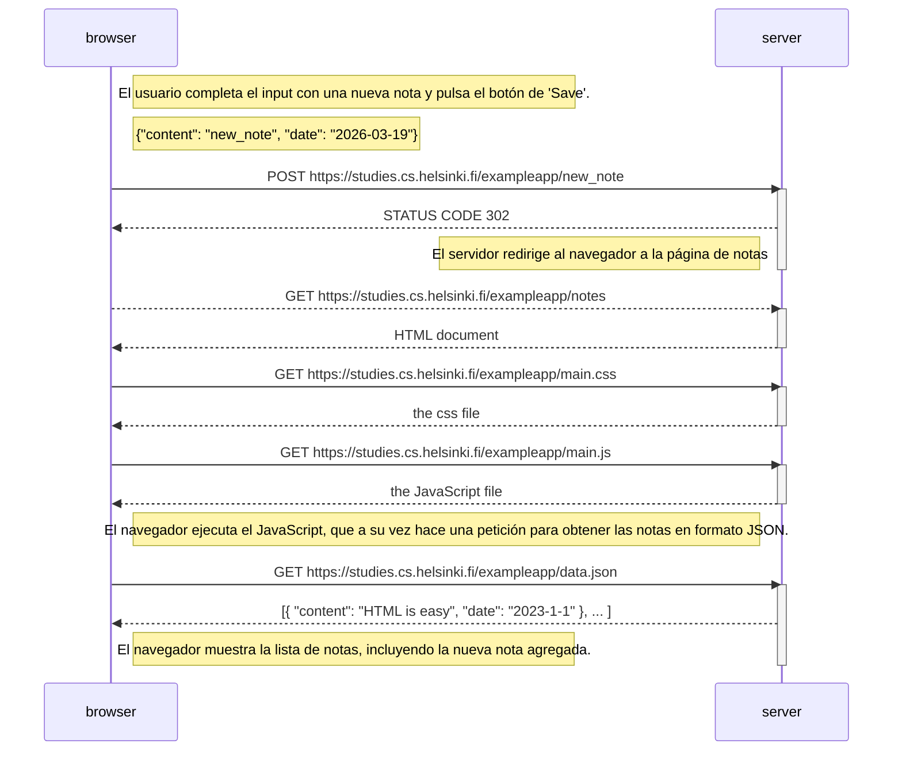

```mermaid
sequenceDiagram
    participant browser
    participant server

    Note right of browser: El usuario completa el input con una nueva nota y pulsa el botón de 'Save'.
    Note right of browser: {"content": "new_note", "date": "2026-03-19"}
    
    browser->>server: POST https://studies.cs.helsinki.fi/exampleapp/new_note
    activate server
    server-->>browser: STATUS CODE 302
    Note left of server: El servidor redirige al navegador a la página de notas
    deactivate server

    browser-->>server: GET https://studies.cs.helsinki.fi/exampleapp/notes
    activate server
    server-->>browser: HTML document
    deactivate server

    browser->>server: GET https://studies.cs.helsinki.fi/exampleapp/main.css
    activate server
    server-->>browser: the css file
    deactivate server

    browser->>server: GET https://studies.cs.helsinki.fi/exampleapp/main.js
    activate server
    server-->>browser: the JavaScript file
    deactivate server

    Note right of browser: El navegador ejecuta el JavaScript, que a su vez hace una petición para obtener las notas en formato JSON.

    browser->>server: GET https://studies.cs.helsinki.fi/exampleapp/data.json
    activate server
    server-->>browser: [{ "content": "HTML is easy", "date": "2023-1-1" }, ... ]
    Note right of browser: El navegador muestra la lista de notas, incluyendo la nueva nota agregada.
    deactivate server
```