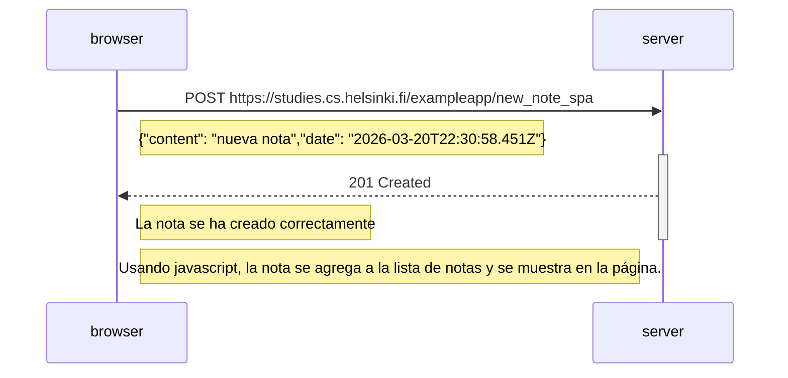

```mermaid
sequenceDiagram
    participant browser
    participant server

    browser->>server: POST https://studies.cs.helsinki.fi/exampleapp/new_note_spa
    Note right of browser: {"content": "nueva nota","date": "2026-03-20T22:30:58.451Z"}
    activate server
    server-->>browser: 201 Created
    Note right of browser: La nota se ha creado correctamente
    deactivate server

    Note right of browser: Usando javascript, la nota se agrega a la lista de notas y se muestra en la página.

```
